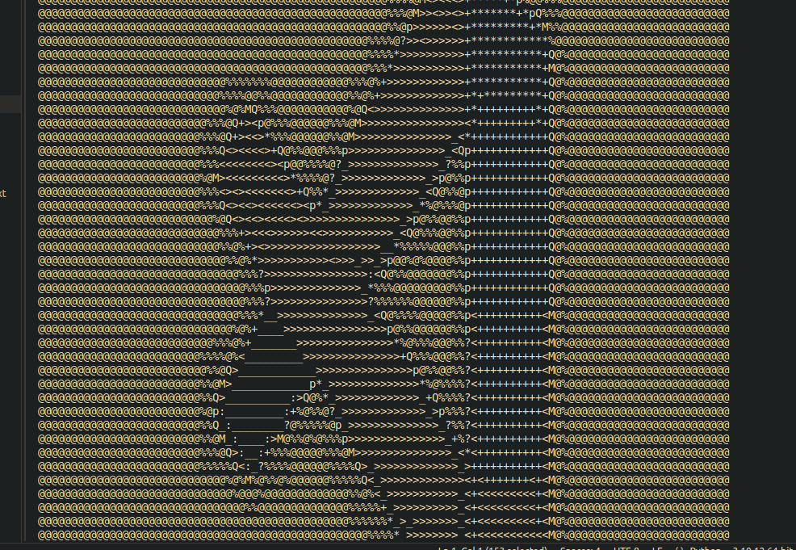
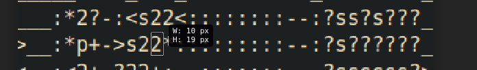
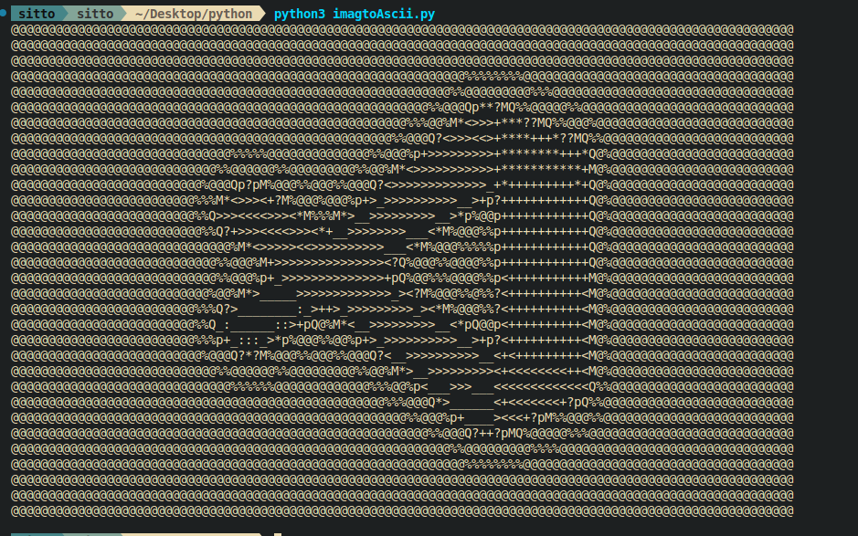
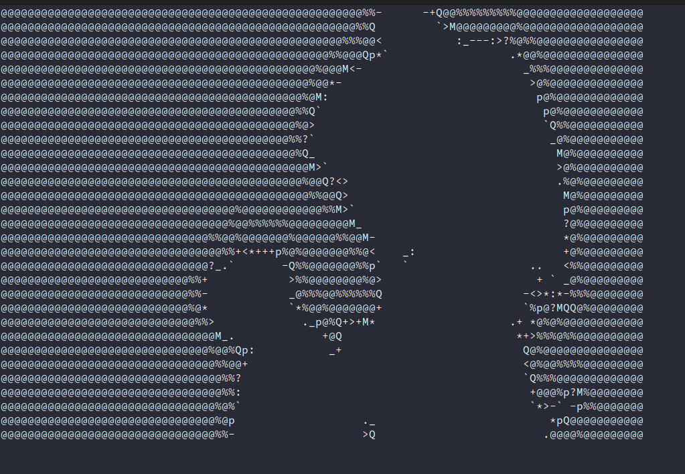
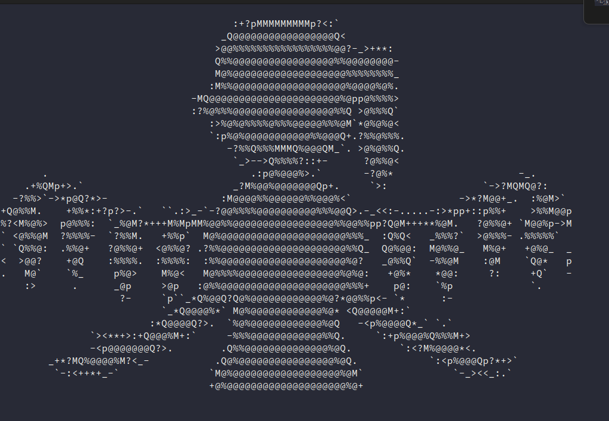
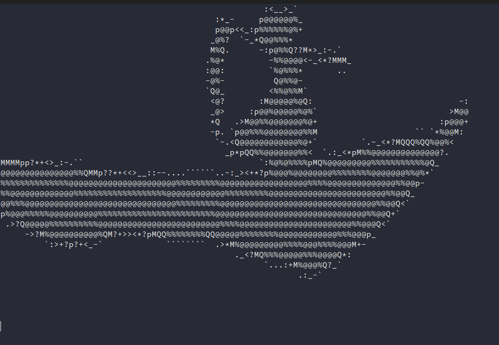

# There is basically 3 steps:
1.convert video into image file(technically extract each frame from a video into image file)
2.Convert each frame into ascii art
3.Print the each frame's art in the terminal

## STEP 1
This is the easier step. You can convert video to image simply using opencv library. Each frame is stored inside data folder as jpg file.

For linux it is easier, you don't required write a python script, you can use `ffmpeg`
```
ffmpeg -i input_video.mp4 -vf "fps=10" data/frame_%04d.png
```
## STEP 2
This step is the key step of the whole process. 
### How to convert Image into ascii art??
->In short take image open it using image processing library such as PIL, Scikit-Image, OpenCv. Calculate each pixel intensity and determine character from text[ `.-:_><+*?pMQ%@] according to the intensity value. Repeat this process for each pixel and store it to print it.
max intensity='@'
min intensity=' '

### Things to be considered
1) Resize the image(image of higher resolution takes huge canvas to render and it also takes much space and memory, so to solve this problem we need to scale down the image). Just multiply width and height with 0.1 or 0.2,0.3,0.4 depending on the size of image


2) After these all step also, the ascii art is not satisfying and this due to vertical elongation.



 Each pixel size is square but each character size is rectangle having height greater than width while rendering text in the terminal which causes the vertical elongation.



The following problem can solved by converting resized image into horizontal elongated image. This can be achieved by simple maths proportions. We need to multiply resized height by ratio of width/height of obtained renderd from terminal. And that ratio is same as width/height of single character. So we can use it directly elongate the image. After this step we can get desired result.



## STEP 3
This step can be easily achieved. We can use `os` and `time` module to render each frame in terminal
and 10 frames persecond.
---

---

---



